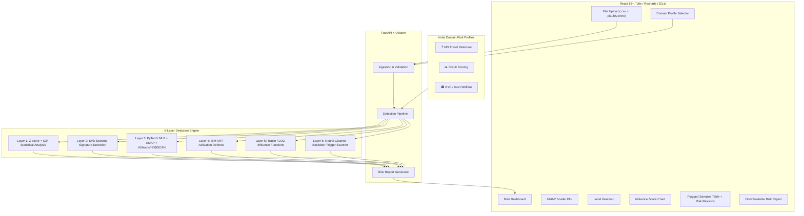

# AI PoisonGuard 🛡️

**Adversarial Training Data Poisoning Detector for Indian Fintech & Government ML Systems**

> 🏆 VIBE6 INNOVATHON 2026 — SVKM's NMIMS, Indore — Challenge 4 Submission

## Executive Summary

AI PoisonGuard is a web-based dashboard that detects adversarial training data poisoning attacks on ML models deployed in India's critical fintech and government systems (UPI, Aadhaar KYC, PMJAY). It accepts uploaded ML models (`.pkl`, `.h5`, `.onnx`) and CSV training datasets, runs a **6-layer detection pipeline**, and produces a visual **Poison Risk Report** detailing affected data clusters, mislabeled samples, backdoor trigger patterns, and anomalous weight patterns.

⚠️ **Educational prototype** using mock/synthetic data only. Not a production-ready, government-certified, or commercial auditing tool.

## Architecture



## Detection Engine — 6 Layers

### Layer 1 — Statistical Analysis (Z-score + IQR)
- Per-feature Z-score outlier detection with configurable threshold
- IQR-based fence outlier detection
- Chi-squared label distribution anomaly test with entropy analysis
- Composite anomaly scoring (Gini impurity + normalized entropy)

### Layer 2 — Spectral Signature Detection (SVD)
- Centered data matrix SVD decomposition (truncated SVD for large datasets)
- Spectral signature correlation with top-k singular vectors
- Per-class spectral analysis for targeted poisoning detection
- Singular value distribution analysis (energy concentration)
- *Reference: Tran et al., "Spectral Signatures in Backdoor Attacks" (NeurIPS 2018)*

### Layer 3 — Activation Clustering (PyTorch MLP + UMAP + KMeans/HDBSCAN)
- **PyTorch MLP shadow model** training for penultimate-layer activation extraction
- UMAP dimensionality reduction to 2D (fallback: PCA)
- KMeans / **HDBSCAN** clustering with configurable parameters
- Cluster-label purity analysis + silhouette score evaluation
- *Reference: Chen et al., "Detecting Backdoor Attacks by Activation Clustering" (2019)*

### Layer 4 — IBM ART Validation
- Integration with IBM Adversarial Robustness Toolbox (ART)
- ActivationDefence cross-validation with configurable clustering
- Graceful fallback to Isolation Forest when ART is unavailable

### Layer 5 — Influence Function Analysis (NEW)
- **TracIn gradient-based** self-influence scoring (PyTorch, with checkpoint accumulation)
- **Leave-One-Out (LOO)** influence estimation for disproportionately impactful samples
- OOB probability-based confidence analysis
- *Reference: Koh & Liang, "Understanding Black-box Predictions via Influence Functions" (ICML 2017)*
- *Reference: Pruthi et al., "Estimating Training Data Influence by Tracing Gradient Descent" (NeurIPS 2020)*

### Layer 6 — Backdoor Trigger Scanning (NEW)
- **Feature-space trigger detection**: fixed/constant value patterns co-occurring with label subsets
- **Neural Cleanse-inspired** perturbation analysis: minimum perturbation to flip predictions
- **Entropy-based anomaly detection**: per-feature, per-class entropy profiling
- *Reference: Wang et al., "Neural Cleanse: Identifying and Mitigating Backdoor Attacks" (IEEE S&P 2019)*

## India Domain Risk Profiles

| Profile | Risk Level | Z-Threshold | IQR | Clusters | Min Purity |
|---------|-----------|-------------|-----|----------|------------|
| ₹ UPI Fraud Detection | HIGH | 2.5 | 1.3× | 6 | 80% |
| 📊 Credit Scoring | MEDIUM | 3.0 | 1.5× | 4 | 85% |
| 🏛️ KYC / Govt Welfare | HIGH | 2.8 | 1.4× | 5 | 82% |
| 🔍 General Purpose | MEDIUM | 3.0 | 1.5× | 5 | 85% |

**Regulatory context**: RBI Digital Payment Security Controls (2021), NPCI UPI Fraud Monitoring Guidelines, UIDAI Aadhaar Act 2016, MeitY Digital India Guidelines, CERT-In Cyber Security Framework, DPDP Act 2023.

## Tech Stack

| Component | Technology |
|-----------|-----------|
| ML Backend | Python 3.11 + scikit-learn + IBM ART |
| Deep Learning | PyTorch (shadow model + TracIn influence) |
| Detection | scipy, numpy, UMAP-learn, HDBSCAN |
| API Layer | FastAPI + Uvicorn |
| Frontend | React 18+ (Vite) + Recharts + D3.js |
| Styling | Custom CSS (glassmorphism design system) |

## Quick Start

### Backend
```bash
cd backend
python -m venv venv
source venv/bin/activate  # or venv\Scripts\activate on Windows
pip install -r requirements.txt
uvicorn main:app --reload --port 8000
```

### Frontend
```bash
cd frontend
npm install
npm run dev
```

### Generate Demo Data + Train Model
```bash
cd backend
source venv/bin/activate
python -m demo_data.generate_upi_dataset
python -m demo_data.generate_credit_dataset
python -m demo_data.generate_demo_model
```

This generates:
- `demo_upi_fraud.csv` — 2000 synthetic UPI transactions (5% poisoned)
- `demo_credit_scoring.csv` — 2000 synthetic credit applications (5% poisoned)
- `demo_model.pkl` — RandomForest trained on UPI fraud data
- `demo_shadow_model.pt` — PyTorch shadow model

## API Endpoints

| Method | Endpoint | Description |
|--------|----------|-------------|
| POST | `/api/analyze` | Full 6-layer poisoning analysis |
| GET | `/api/profiles` | List available domain profiles |
| GET | `/api/health` | Health check with dependency status |

### Model Ingestion

| Format | Library | Upload Support |
|--------|---------|---------------|
| `.pkl` | scikit-learn | ✅ Full |
| `.h5` | Keras / TensorFlow | ✅ Full |
| `.onnx` | ONNX Runtime | ✅ Full |

## Dashboard Visualisations

1. **UMAP Cluster Scatter Plot** — 2D projection of clean vs. poisoned samples (colored by cluster)
2. **Label Distribution Heatmap** — Anomalous label concentrations highlighted in red
3. **Influence Score Bar Chart** — Top-20 most suspicious samples ranked by composite influence
4. **Flagged Samples Table** — Sortable, with per-sample **risk reasons**, downloadable CSV export
5. **Downloadable Risk Report** — Full HTML report with all layer results and flagged samples

## Disclaimer

⚠️ **Educational prototype** using mock/synthetic data only. Not a production tool.

Real-world deployment would require:
- CERT-In empanelment under IT Act 2000 Section 70
- RBI AI/ML Governance Framework 2024 alignment (explainability)
- DPDP Act 2023 compliance (6-12 month process minimum)
- No PII/real transaction data permitted
- Responsible disclosure norms apply

---

*VIBE6 INNOVATHON 2026 — SVKM's NMIMS, Indore — Challenge 4: AI PoisonGuard*
